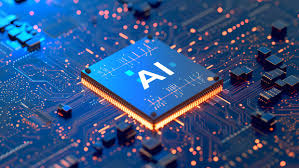

# :material-robot-happy: Inteligencia Artificial Moderna

La Inteligencia Artificial (IA) es una de las tecnologías más importantes del siglo XXI. Su capacidad para analizar datos, aprender patrones y tomar decisiones está transformando sectores como la medicina, la educación, la seguridad y la industria.

!!! note "¿Qué es la IA?"
    La Inteligencia Artificial es una rama de la informática que busca crear sistemas capaces de realizar tareas que normalmente requieren inteligencia humana.

## ¿Por qué es importante?

- Automatiza procesos.
- Analiza grandes cantidades de datos.
- Mejora la toma de decisiones.
- Impulsa la innovación tecnológica.

## Comparación de tecnologías

| Tecnología            | Capacidad de aprendizaje  | Uso principal             |
|-----------------------|---------------------------|---------------------------|
| Software tradicional  | No                        | Automatización            |
| Machine Learning      | Sí                        | Predicción                |
| Deep Learning         | Sí                        | Reconocimiento avanzado   |
| IA Generativa         | Sí                        | Creación de contenido     |

Para continuar, visita la sección de [Fundamentos](fundamentos.md)
